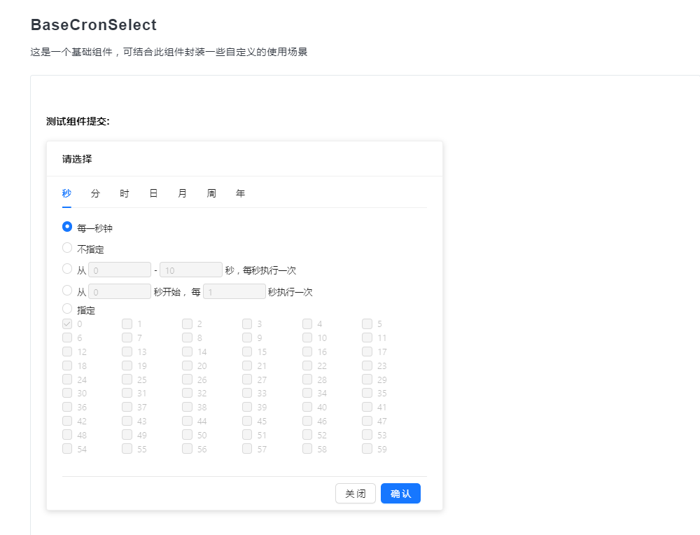
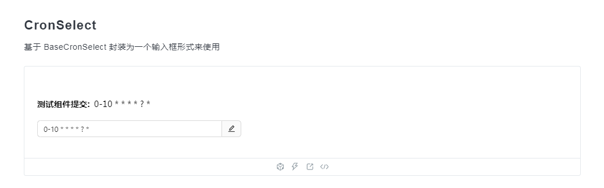
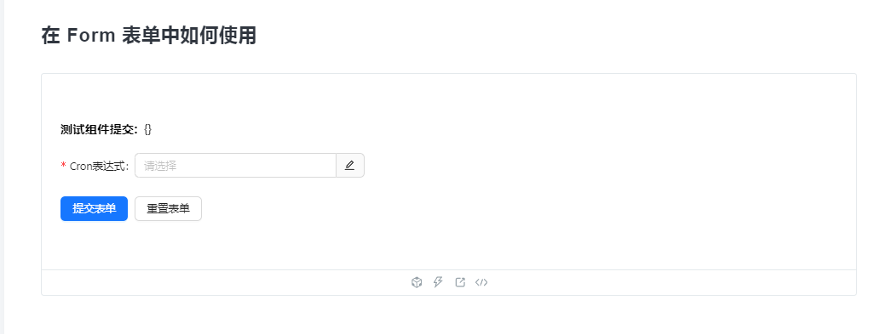
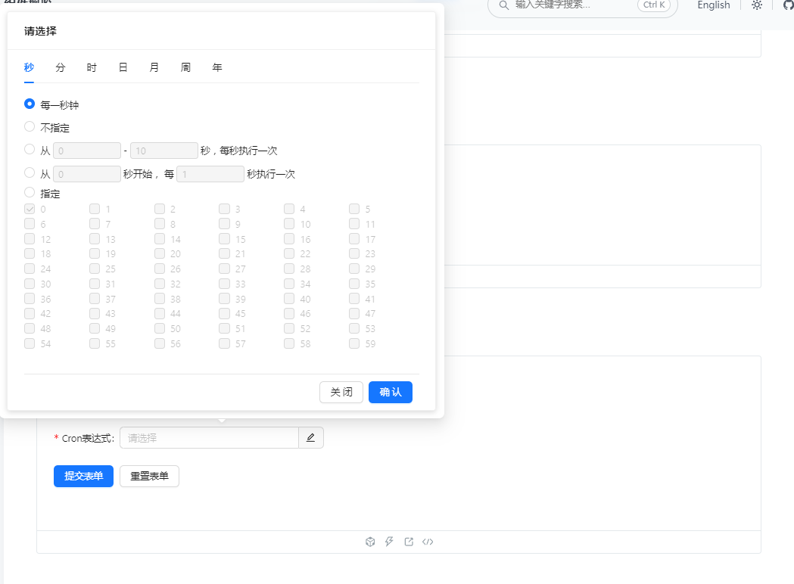

# react-cron-select

[](https://npmjs.org/package/react-cron-select)
[](https://npmjs.org/package/react-cron-select)

> 基于 React 的 Cron 表达式生成组件 🌈

> 遇到使用难题，可以提出 Issues 🔥

> 如果您发现这个组件对您有益，不妨给予作者一颗星的鼓励 🌟

## ✨ 特性

- 使用 TypeScript 编写，具有可预测的静态类型
- 全面支持 cron：秒、分、时、日、月、周、年
- 支持反解析 cron 表达式到 UI

## 📦 安装

> 包的安装有多种方式，使用其一即可

```bash
npm install react-cron-select

pnpm install react-cron-select

yarn add react-cron-select
```

### 💻 预览地址

[点击直达](https://louhaojie99.github.io/react-cron-select/)

## 🔨 用法

组件使用指南：[点击直达](https://louhaojie99.github.io/react-cron-select/)

### BaseCronSelect

这是一个基础组件，可结合此组件封装一些自定义的使用场景



### CronSelect

基于 BaseCronSelect 封装为一个输入框形式来使用



### 在 Form 表单中如何使用




## 📢 声明

该组件改编自 [qnn-react-cron](https://github.com/louhaojie99/qnn-react-cron)
改编原因：作者长时间未更新组件 一些使用的问题未能得到及时的处理和更新

## LICENSE

MIT
